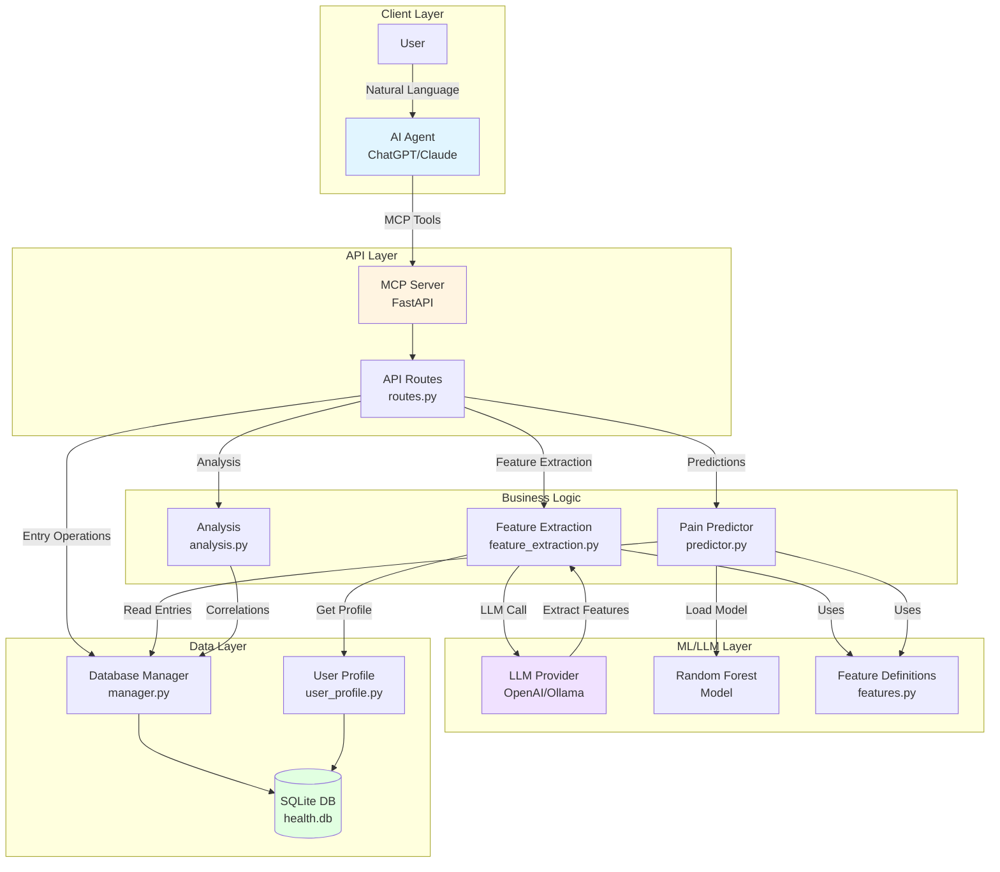

# Personal Health MCP System Architecture

## Component Descriptions

### Client Layer
- **AI Agent**: External AI agents (ChatGPT, Claude) that interact via MCP protocol
- **User**: End user providing natural language input

### API Layer
- **MCP Server**: FastAPI server exposing MCP tools
- **API Routes**: RESTful endpoints for all operations

### Business Logic
- **Feature Extraction**: LLM-based extraction of binary features from meal descriptions
- **Pain Predictor**: ML-based pain level prediction using Random Forest
- **Analysis**: Correlation and trigger analysis

### ML/LLM Layer
- **LLM Provider**: OpenAI or Ollama for feature extraction
- **Random Forest Model**: Trained model for pain prediction
- **Feature Definitions**: Enums defining 19 binary features

### Data Layer
- **Database Manager**: SQLite operations and migrations
- **User Profile**: Dietary preferences and profile management
- **SQLite DB**: Persistent storage for entries and profiles

## Key Data Flows

1. **Entry Creation**: User → Agent → MCP → Routes → DBManager → SQLite
2. **Feature Extraction**: Routes → FeatureExt → Provider (LLM) → Extract → Update DB
3. **Pain Prediction**: Routes → Predictor → Load Model → Read Entries → Predict
4. **Profile Updates**: Agent → MCP → Routes → UserProfile → SQLite

## Technology Stack

- **API Framework**: FastAPI
- **Database**: SQLite with custom migration system
- **ML Framework**: scikit-learn (Random Forest)
- **LLM Providers**: OpenAI GPT-4o-mini / Ollama (local)
- **Feature Engineering**: 47 features (21 lag + 1 temporal + 6 rolling + 19 binary)
- **Protocol**: Model Context Protocol (MCP)
